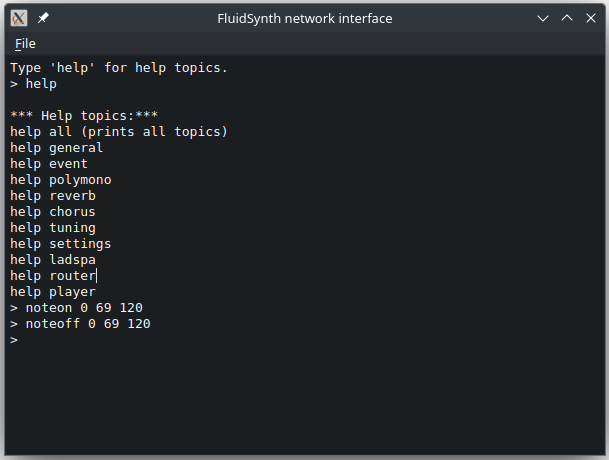
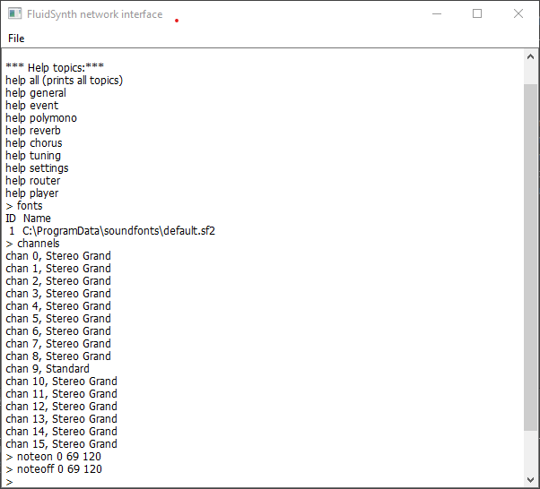

# NetCat implementation using Qt

This is a basic `netcat` implementation ( see [nc(1)](https://linux.die.net/man/1/nc) ), using Qt6 widgets and Qt6 Network. The console window is based on [ConsoleWidget](https://github.com/pedrolcl/consolewidget).

The defaults are the same as the FluidSynth shell interface, and that is why this app has been developed. You can start the synth with a `-s` command line argument, and then use this program to connect to fluidsynth, even from another computer!

```shell
$ fluidsynth -s
```

```shell
$ netcat-qt -a localhost -p 9800
```

  
  

Another alternative providing a GUI shell interface for the FluidSynth library is [fluidsynt-qt-gui](https://github.com/pedrolcl/fluidsynth-qt-gui).

## License

SPDX-License-Identifier: MIT  
Copyright (c) 2024 Pedro López-Cabanillas <plcl@users.sf.net>
